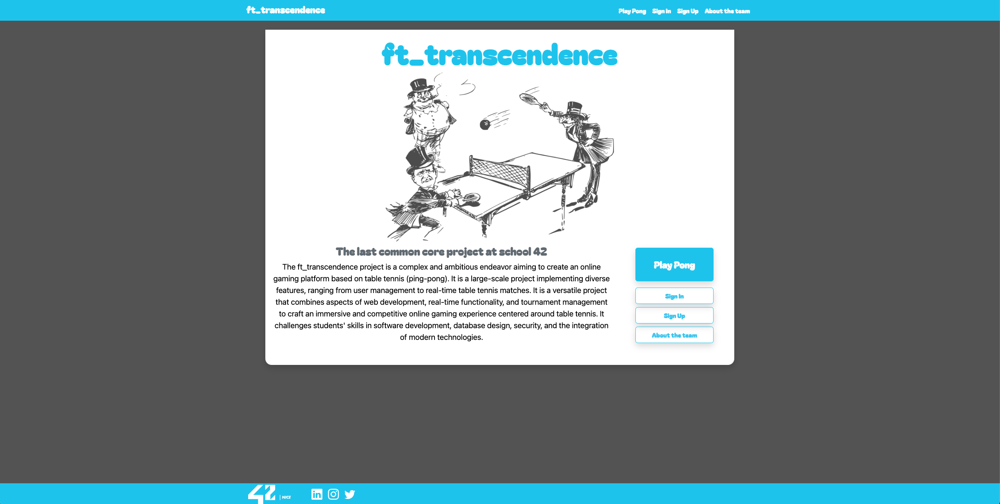
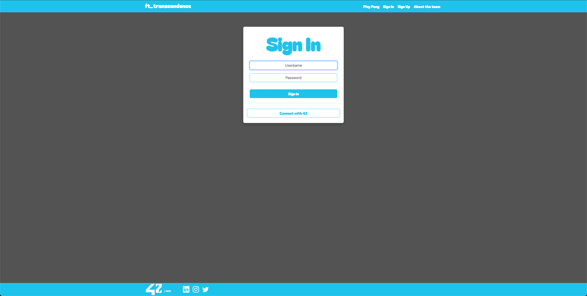
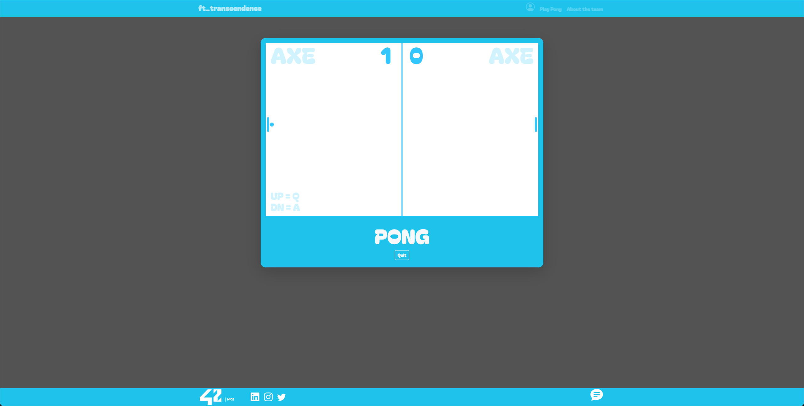
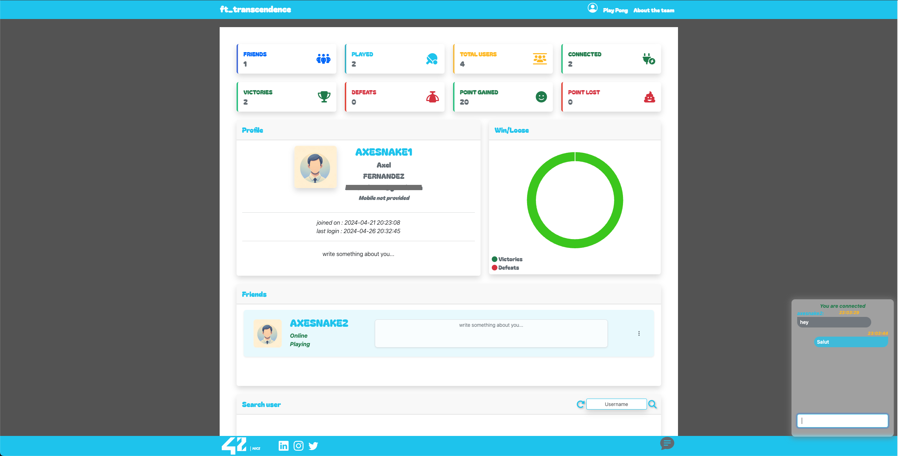

# ft_transcendence : last 42 school common-core project

## Introduction

This project aims to create a website for participating in a competition of the famous game Pong! The project is realized in modules, listed as follows:

Mandatory:
1. Major Module: Django Backend
2. Minor Module: Frontend Bootstrap
3. Minor Module: PostgreSQL Database
4. Major Module: User Management
5. Major Module: OAuth 42
6. Major Module: Remote Players
7. Major Module: Live Chat
8. Major Module: Implementing AI-controlled Opponent

Bonus:
9. Minor Module: User and Game Stats Dashboards
10. Major Module: Two-Factor Authentication (2FA) and JWT
11. Minor Module: Monitoring System
12. Minor Module: Support on All Devices

## Gallery

## Site Availability

You can check if the site is available at :

[transcendence.website](https://transcendence.website)

## Remerciements

Thanks to the entire team for this project, achieved with a score of 125/100:
@Chris
@Paul
@Youssef

Axel Fernandez